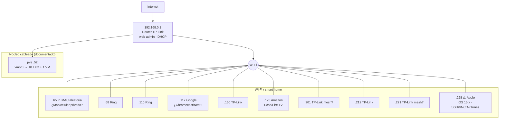

# Mapa de red LAN (192.168.0.0/24)

Topología completa de la red local, resultado del barrido del 2026-09-11. Complementa el [[(C) Mapa del servidor pve]] (inventario de guests) y los [[(C) Diagramas pve]]. **Se desactualiza** — redes Wi-Fi y DHCP cambian; verificar con `nmap -sn --send-eth 192.168.0.0/24` desde el host.

## Resumen

- **32 hosts vivos** en un `/24` plano (sin VLANs): router + host pve + 19 guests Proxmox + **10 dispositivos Wi-Fi/smart home**.
- Router **TP-Link** (.1, web admin, Linux) — gateway `192.168.0.1`, DHCP, sin SNMP.
- Todo el núcleo (host + guests) es cableado vía `vmbr0`; el resto es Wi-Fi.
- 2 dispositivos **con MAC aleatoria sin identificar** (.65 y .228) + 1 nuevo contenedor sin confirmar (CT 117).

## Tabla de hosts

| IP | MAC | Fabricante | Identificación | Estado |
|---|---|---|---|---|
| .1 | 8C:86:DD:66:BD:9E | TP-Link Systems | **Router/gateway** — web admin :80, DHCP | Infra |
| .10 | BC:24:11:44:DB:0C | Proxmox | CT 104 AdGuard | Documentado |
| .11 | BC:24:11:53:ED:49 | Proxmox | CT 105 Unbound | Documentado |
| .12 | BC:24:11:DB:79:83 | Proxmox | CT 108 cloudflared | Documentado |
| .13 | BC:24:11:32:40:29 | Proxmox | CT 110 n8n | Documentado |
| .14 | BC:24:11:F8:8D:81 | Proxmox | **CT 117 `difybot`** — Dify 1.17.1 (15 contenedores), IP fija + onboot ✅ 2026-09-12 | ✅ Regularizado |
| .20 | BC:24:11:54:56:D2 | Proxmox | CT 111 apps-prod | Documentado |
| .21 | BC:24:11:34:A6:BE | Proxmox | CT 112 app-dev | Documentado |
| .30 | BC:24:11:90:6B:8F | Proxmox | CT 114 vaultwarden | Documentado |
| .32 | BC:24:11:71:69:F7 | Proxmox | CT 113 rclone | Documentado |
| .52 | — | — | **pve host** (Proxmox) | Infra |
| .61 | BC:24:11:8D:C6:64 | Proxmox | CT 107 docker/Portainer | Documentado |
| .64 | BC:24:11:23:BC:BB | Proxmox | CT 109 claude-dev | Documentado |
| .65 | AA:F3:52:2E:5E:D7 | MAC aleatoria | **???** — sin servicios estándar, solo puertos altos (tcpwrapped) | ⚠️ Sin identificar |
| .68 | 18:7F:88:65:4C:83 | Ring | Dispositivo Ring (cámara/timbre) | Smart home |
| .99 | BC:24:11:00:27:D2 | Proxmox | CT 103 openwebui (Ollama) | Documentado |
| .103 | 02:62:D0:1A:90:EC | virtio | VM 106 Home Assistant | Documentado |
| .109 | BC:24:11:87:84:2B | Proxmox | CT 100 Nginx Proxy Manager | Documentado |
| .110 | 18:7F:88:72:84:63 | Ring | Dispositivo Ring (cámara/timbre) | Smart home |
| .117 | AC:67:84:0A:04:A9 | Google | ¿Chromecast / Nest / Android TV? | Smart home |
| .132 | BC:24:11:AC:7C:54 | Proxmox | CT 400 medinotes | Documentado |
| .150 | 1C:3B:F3:85:58:7E | TP-Link | Smart home TP-Link (¿Tapo/Kasa?) | Smart home |
| .164 | BC:24:11:27:37:05 | Proxmox | CT 115 debmediav2 | Documentado |
| .175 | 48:5F:2D:B4:66:26 | **Amazon** | ¿Echo / Fire TV / Kindle? Sin puertos abiertos | Smart home |
| .179 | BC:24:11:67:80:3C | Proxmox | CT 116 ntfy | Documentado |
| .201 | 68:7F:F0:51:3E:34 | TP-Link Limited | ¿Deco/Archer (mesh)? | Smart home |
| .203 | BC:24:11:67:05:AA | Proxmox | CT 101 debian | Documentado |
| .212 | 0C:80:63:B1:45:F4 | TP-Link | Smart home TP-Link (¿Tapo/Kasa?) | Smart home |
| .216 | BC:24:11:6A:EE:6F | Proxmox | CT 102 uptimekuma | Documentado |
| .221 | 68:7F:F0:68:69:8D | TP-Link Limited | ¿Deco/Archer (mesh)? | Smart home |
| .228 | 6A:BB:4B:B0:DA:1F | MAC aleatoria | **Apple iOS 15.x/macOS** — SSH :22, Kerberos :88, ARD VNC :5900, AirTunes :5000/:7000, eppc :3031 | ⚠️ Sin identificar |
| .230 | BC:24:11:58:B9:C7 | Proxmox | CT 901 ubuntu (GromacsMexicano) | Documentado |
| .23 | BC:24:11:* | Proxmox | **CT 118 `control`** — controlador SSH del stack (NUEVO 2026-09-12) | Documentado |

## Hallazgos del barrido

1. **═ CT 117 `difybot` — ✅ REGULARIZADO 2026-09-12** — IP fija .14 + onboot 1. Corre Dify 1.17.1 con 15 contenedores (nginx :80/:443 + api + agent + postgres). Ver [[(C) Reglas por LXC]].
2. **.65 (AA:F3:52)** — MAC aleatoria (privada). Responde solo en puertos altos efímeros con tcpwrapped. Patrón compatible con **celular/Mac en Wi-Fi con dirección privada** (continuity/Bonjour ocupan puertos altos). ⚠️ Verificar: en tu Mac/iPhone, ¿Wi-Fi con "dirección privada"?
3. **.228 (6A:BB:4B)** — MAC aleatoria, fingerprint **Apple (iOS 15.7 / Darwin 21)** con SSH :22 + ARD VNC :5900 + AirTunes. Muy probablemente un **Mac/iPhone viejo con Remote Management activo** (o jailbroken). ⚠️ ¿Qué equipo es?
4. **.175 = Amazon** (Echo/Fire TV/Kindle) — sin puertos abiertos al escanear (dormido).
5. **Ecosistema TP-Link**: router (.1) + 4 dispositivos (.150/.201/.212/.221) — probablemente mesh Deco/Archer + smart plugs. Coherente con Home Assistant.
6. **2 Ring + 1 Google** (.117: Chromecast/Nest) — smart home en Wi-Fi.
7. **No apareció un Mac de escritorio "estándar"** con SMB/445 — la Mac cliente monta el vault sin exponer puertos, así que puede ser el .65 o el .228.

## Diagrama

## Cómo se mantiene

- Re-scan: `ssh root@192.168.0.52 "nmap -sn --send-eth 192.168.0.0/24"` (~10 s). Comparar contra esta tabla.
- Los OUI nuevos (`nmac` no los conoce) se resuelven en https://maclookup.app/.
- DHCP cambia IPs → preferir reservas estáticas en el router para lo que no sea Proxmox (los guests ya tienen IP fija en config).