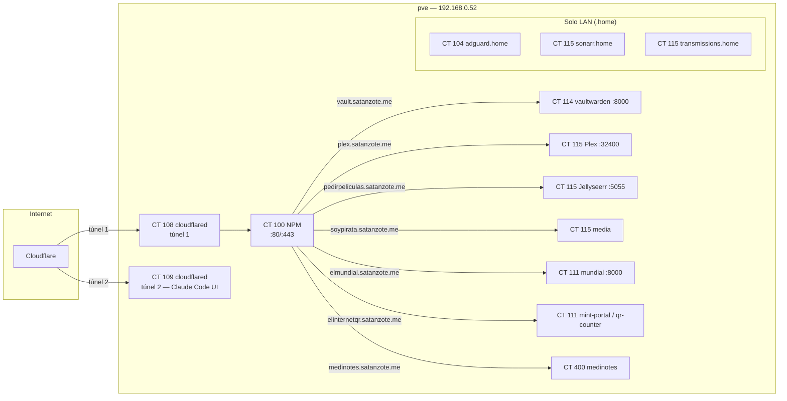
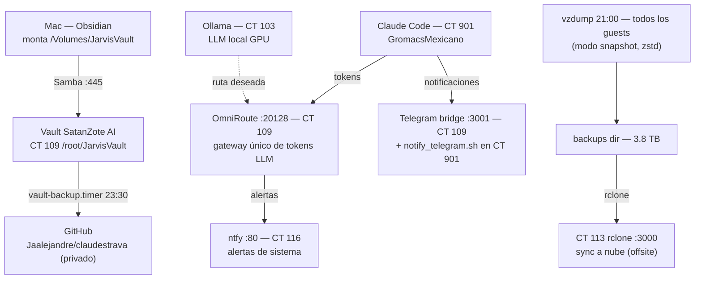

# Diagramas visuales del servidor `pve`

Diagramas Mermaid — **Obsidian los renderiza en modo lectura/Preview con zoom**. Se desactualizan igual que el [[(C) Mapa del servidor pve]]: antes de operar, verificar en vivo (`ssh root@192.168.0.52`). Al actualizar el mapa, actualizar también estos diagramas y el `actualizado` del frontmatter.

## 1. Topología completa

```mermaid
flowchart TB
    subgraph EXT["Internet"]
        CF["Cloudflare<br/>*.satanzote.me"]
        MAC["Mac<br/>Obsidian + Claudian"]
    end

    subgraph HOST["pve — Proxmox VE 9.1.1 · i5-14600K 14c/20t · RAM 31 GB · vmbr0 192.168.0.52 · Tailscale 100.85.38.121"]

        subgraph STO["Storage"]
            LOCAL["local · dir · 94 GB<br/>ISOs plantillas snippets"]
            LVM["local-lvm · lvmthin · 832 GB<br/>discos de todos los guests"]
            BAK["backups · dir · 3.8 TB<br/>vzdump + rclone"]
            NVME["nvme-fast · dir · 245 GB<br/>modelos Ollama (CT 103)"]
        end

        subgraph IN["Capa de entrada"]
            T108["CT 108 cloudflared (.12)<br/>tunnel a internet"]
            NPM["CT 100 NPM (.109)<br/>reverse proxy :80 · :81 · :443"]
            ADG["CT 104 AdGuard (.10)<br/>DNS :53"]
            UNB["CT 105 Unbound (.11)<br/>resolver :5335"]
        end

        subgraph NODEIA["Nodo de IA"]
            I109["CT 109 claude-dev (.64)<br/>OmniRoute :20128<br/>Samba → vault :445<br/>telegram-bridge :3001<br/>Claude Code UI :20241"]
        end

        subgraph APPS["Apps"]
            A111["CT 111 apps-prod (.20)<br/>mundial :8000 · nextcloud :8088<br/>guacamole :8090 · mint-portal :5010<br/>open-webui :3000"]
            A112["CT 112 app-dev (.21)<br/>mundial-dev :8000<br/>airbnb-dashboard :8090"]
            A101["CT 101 debian (.203)<br/>enlinea-saas :8091<br/>satanzote-studio :8085"]
            A400["CT 400 medinotes (.132)<br/>nginx + API :8000<br/>postgres + redis"]
        end

        subgraph MEDIA["Media"]
            M115["CT 115 debmediav2 (.164)<br/>Plex :32400 · Jellyseerr :5055<br/>Sonarr Radarr Prowlarr Bazarr<br/>Tdarr Tautulli Navidrome<br/>Transmission SABnzbd"]
        end

        subgraph SVC["Servicios"]
            S114["CT 114 vaultwarden (.30) :8000"]
            S102["CT 102 uptimekuma (.216) :3001"]
            S110["CT 110 n8n (.13) :5678"]
            S116["CT 116 ntfy (.179) :80"]
            S107["CT 107 docker (.61)<br/>Portainer :9443"]
            S113["CT 113 rclone (.32)<br/>sync a nube :3000"]
        end

        subgraph LLMLOCAL["LLM local"]
            O103["CT 103 openwebui (.99)<br/>Ollama :11434<br/>Open WebUI :8080<br/>modelos → nvme-fast"]
        end

        subgraph HPC["Cómputo"]
            G901["CT 901 ubuntu (.230)<br/>GromacsMexicano C++ CUDA<br/>gpu-api :5000"]
        end

        subgraph VMS["VMs"]
            V106["VM 106 haos (.103)<br/>Home Assistant"]
        end

        GPU["GPU NVIDIA RTX 5070 Ti 16 GB<br/>passthrough → CT 103 · 901<span style='color:#888'> · 109 retirado 2026-09-11</span>"]
        VZD["vzdump diario 21:00<br/>todos los guests → backups"]
    end

    CF -->|tunnel Cloudflare| T108
    T108 --> NPM
    NPM -->|vault.satanzote.me| S114
    NPM -->|elmundial.satanzote.me| A111
    NPM -->|plex · pedirpeliculas · soypirata| M115
    NPM -->|medinotes| A400
    ADG -->|upstream| UNB
    MAC -->|SMB| I109
    I109 -->|Claude Code · tokens| G901
    O103 -.->|LLM local| I109
    GPU --> O103
    GPU --> G901
    VZD --> BAK
    BAK -->|rclone offsite| S113
```

## 2. Exposición a internet

## 3. Flujos críticos

## Cómo se mantiene

- Fuente de verdad: [[(C) Mapa del servidor pve]] (barrido por SSH) + [[(C) Tecnologías y proyectos por contenedor]].
- Cuando cambie el inventario (CT nuevo/apagado, servicio nuevo, dominio nuevo): editar el diagrama correspondiente y el `actualizado` del frontmatter.
- Grafos ligeros (solo notas): usar el **Graph View** filtrado a la carpeta `Arquitectura/` — cada CT/VM tiene su nota-​nodo [[Arquitectura]].