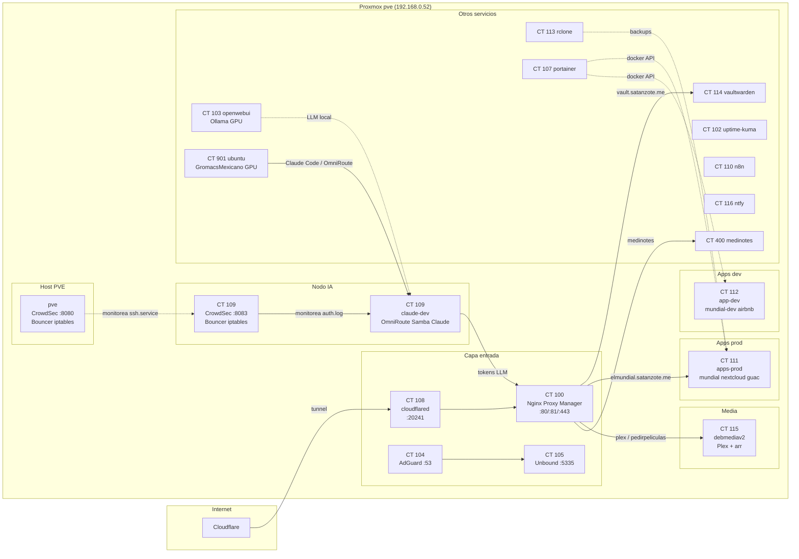

# Arquitectura del servidor `pve`

Mapa de contenido (MOC) de la topología: qué corre en cada CT/VM y cómo se conectan. Cada nodo es una nota — **abre el Graph View filtrado a esta carpeta para ver la topología como grafo**.

- Datos a nivel host: [[(C) Mapa del servidor pve]]
- **Topología de la red LAN (todos los dispositivos)**: [[(C) Mapa de red LAN]]
- Detalle de tecnologías: [[(C) Tecnologías y proyectos por contenedor]]
- **Seguridad (CrowdSec)**: [[(C) CrowdSec - monitoring seguridad]]

## Topología general

## Tabla de nodos

| CT | Nota | IP | Rol |
|---|---|---|---|
| 100 | [[CT 100 nginxproxymanager]] | .109 | Reverse proxy |
| 101 | [[CT 101 debian]] | .203 | Docker apps legacy |
| 102 | [[CT 102 uptimekuma]] | .216 | Monitoreo |
| 103 | [[CT 103 openwebui]] | .99 | LLM local (GPU) |
| 104 | [[CT 104 adguard]] | .10 | DNS LAN |
| 105 | [[CT 105 unbound]] | .11 | Resolver recursivo |
| 107 | [[CT 107 docker]] | .61 | Portainer |
| 108 | [[CT 108 cloudflared]] | .12 | Tunnel a internet |
| 109 | [[CT 109 claude-dev]] | .64 | Nodo de IA (vault, OmniRoute) |
| 110 | [[CT 110 n8n]] | .13 | Automatización |
| 111 | [[CT 111 apps-prod]] | .20 | Apps producción |
| 112 | [[CT 112 app-dev]] | .21 | Apps desarrollo/test |
| 113 | [[CT 113 rclone]] | .32 | Sync a nube |
| — | [[(C) CrowdSec - monitoring seguridad]] | — | Seguridad (host + CT 109) |
| 114 | [[CT 114 vaultwarden]] | .30 | Gestor de contraseñas |
| 115 | [[CT 115 debmediav2]] | .164 | Stack de media |
| 116 | [[CT 116 ntfy]] | .179 | Alertas sistema |
| 400 | [[CT 400 medinotes]] | .132 | SaaS notas médicas |
| 901 | [[CT 901 ubuntu]] | .230 | GromacsMexicano (GPU) |

VM:

| VM | Nota | Rol |
|---|---|---|
| 106 | [[VM 106 haos]] | Home Assistant |
| 200 | [[VM 200 debian-brain]] | Sin identificar ⚠️ |

## Fechas de verificación

- **2026-09-08** — barrido en vivo completo (systemd + docker + puertos + carpetas en todos los CTs). Datos volcados en [[(C) Tecnologías y proyectos por contenedor]].
- Se desactualiza — antes de operaciones, verificar en vivo vía `ssh root@192.168.0.52`.